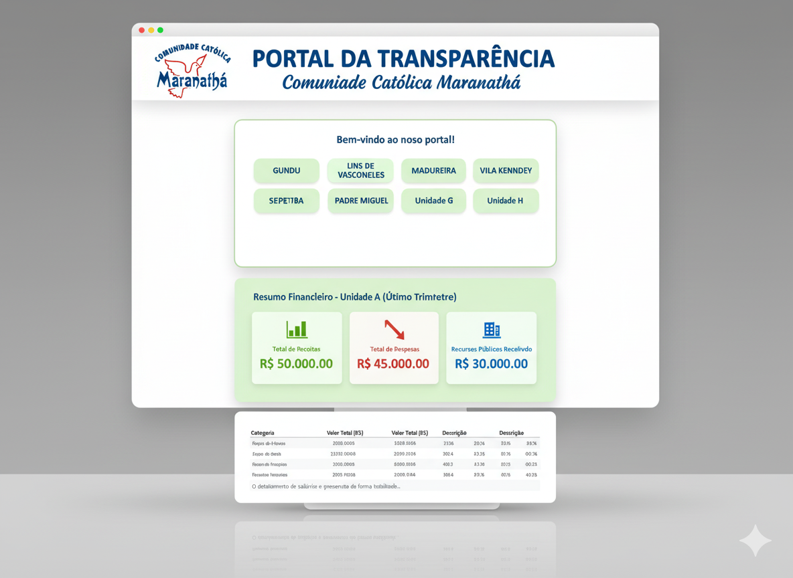

# 🕊️ Portal da Transparência: Comunidade Católica Maranathá

## Uma Janela para a Responsabilidade e a Fé

Este projeto representa o Portal da Transparência da **Comunidade Católica Maranathá**, uma ferramenta digital criada para promover a clareza e a responsabilidade no uso de recursos, especialmente os de origem pública. Atuando como uma comunidade terapêutica, a transparência é um pilar fundamental do nosso compromisso com a sociedade e com a nossa missão.

O portal é um marco na nossa comunicação, oferecendo acesso fácil e detalhado às informações financeiras e de despesas de cada uma das nossas unidades, respeitando sempre a ética e a privacidade dos nossos colaboradores.

## ✨ Principais Funcionalidades

- **Design Responsivo:** O portal foi projetado para funcionar perfeitamente em dispositivos móveis e desktops, garantindo acessibilidade a todos.
- **Transparência Detalhada:** Apresentação clara e discriminada das despesas de cada uma das 8 unidades da comunidade.
- **Navegação Intuitiva:** Um menu interativo no início da página principal permite o acesso rápido às informações de cada unidade.
- **Relatórios Acessíveis:** Seção dedicada a documentos importantes como relatórios anuais e estatutos.
- **Interface Criativa:** Elementos de design visualmente agradáveis e profissionais, como o cabeçalho e os cartões de resumo, que facilitam a leitura.

## 💻 Tecnologias Utilizadas

Este projeto foi construído com ferramentas web essenciais, focando na simplicidade e no desempenho:

- **HTML5:** Estrutura semântica para o conteúdo do portal.
- **CSS3:** Estilização completa para um design moderno e responsivo.

## 🚀 Como Usar o Projeto

Para visualizar o portal, basta baixar todos os arquivos do projeto (incluindo as páginas de cada unidade, o `index.html`, o `style.css` e a imagem `logo.jpg`) e abrir o arquivo `index.html` em qualquer navegador.

Para que a imagem acima seja exibida, salve a captura de tela na pasta do projeto com o nome **`screenshot.png`**.

---

### 👤 Desenvolvido pela Equipe da Comunidade Maranathá

- **Responsável:** Douglas
- **Comunidade:** Comunidade Católica Maranathá
- **Missão:** Oferecer tratamento e acolhimento a dependentes químicos, pautados na fé, na ética e na transparência.